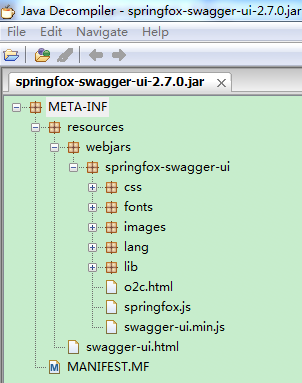

# SpringMVC集成Swagger2

## 1 建立基本SpringMVC工程

###　1.1建立SpringMVC Maven工程

web.xml  
```xml
<servlet>
	<servlet-name>spring</servlet-name>
	<servlet-class>org.springframework.web.servlet.DispatcherServlet</servlet-class>
	<init-param>
		<description>Servlet Context</description>
		<param-name>contextConfigLocation</param-name>
		<param-value>classpath:spring-config/applicationContext.xml</param-value>
	</init-param>
	<load-on-startup>1</load-on-startup>
</servlet>
<servlet-mapping>
	<servlet-name>spring</servlet-name>
	<!-- 拦截所有请求 -->
	<url-pattern>/</url-pattern>
</servlet-mapping>
```
### 1.2创建一个TestController
```java
package com.study.swagger.control;

@Controller
@RequestMapping("/test")
public class TestController {

    @RequestMapping(value="/hello", method=RequestMethod.GET)
    @ResponseBody
    public String sayHello(String name){
        return "hello " + name;
    }
}
```
### 1.3 配置spring bean
applicatonContext.xml
```xml
<mvc:annotation-driven />
<mvc:default-servlet-handler/>
<context:component-scan base-package="com.study.swagger.control" />
```
确保该Controller能够正常访问：  
  

## 2 引入Swagger2
### 2.1 引入Swagger2依赖
```xml
<!-- Swagger2 Dependency -->
<dependency>
	<groupId>io.springfox</groupId>
	<artifactId>springfox-swagger2</artifactId>
	<version>2.7.0</version>
</dependency>
<dependency>
	<groupId>com.fasterxml.jackson.core</groupId>
	<artifactId>jackson-databind</artifactId>
	<version>2.8.7</version>
</dependency>
```

### 2.2 新增Swagger配置类
```java
package com.study.swagger.config;

@Configuration
@EnableSwagger2
public class SwaggerConfig {

    @Bean
    public Docket swaggerSpringMvcPlugin() {
        return new Docket(DocumentationType.SWAGGER_2)
                .select()
                .apis(RequestHandlerSelectors.any())
                .build()
                .apiInfo(apiInfo());
    }

    private ApiInfo apiInfo() {
        return new ApiInfoBuilder()
                .title("Impler Apis")
                .description("Impler Apis details")
                .license("copyright©impler.cn")
                .version("1.0")
                .build();
    }
}

```

### 2.3 配置swagger bean
```xml
<context:component-scan base-package="com.study.swagger.config" />
```

### 2.4 部署启动
访问http://localhost:8080/swagger/v2/api-docs：  
  
返回的JSON信息中，paths对应Controller中RequestMapping配置的路径  

## 3 引入Swagger UI
上面的配置保证了Swagger后台运作正常。Swagger UI实际就是一套完整的操作页面。可以到[https://github.com/swagger-api/swagger-ui](https://github.com/swagger-api/swagger-ui)将这些静态文件下载下来，然后放到webapp根目录。但是这样显然会增加项目结构复杂度。这里采用另外一种方式，即以依赖jar包的方式引入这些静态文件。  

### 3.1 引入Swagger UI依赖
```xml
<dependency>
	<groupId>io.springfox</groupId>
	<artifactId>springfox-swagger-ui</artifactId>
	<version>2.7.0</version>
</dependency>
```
该jar包的结构如下：  
  
这种方式的好处就是不会对现有项目结构造成污染，配置方便。  

### 3.2 部署启动
直接访问Swagger UI的首页：[http://localhost:8080/swagger/swagger-ui.html](http://localhost:8080/swagger/swagger-ui.html)。  
  
点开某个接口连接，输入入参信息，点击Try it Out!按钮即可。  

## 4 包含后缀的URL配置
上述配置的Spring DispatcherServlet拦截所有请求，包括静态资源，即url-pattern为/。但是现实中有很多将DispatcherServlet专门用来处理.do、.action等后缀结尾的请求，即。url-pattern为*.do、*.action。对静态资源的请求则交由default servlet来处理。   
web.xml  
```xml
<servlet-mapping>
    <servlet-name>spring</servlet-name>
    <url-pattern>*.do</url-pattern>
</servlet-mapping>
```
经过观察网络请求发现，Swagger UI在页面加载时会发送如下4个请求：  
- /swagger-resources/configuration/ui：swagger配置信息
- /swagger-resources：swagger资源路径，默认default
- /swagger-resources/configuration/security：swagger安全性信息
- /v2/api-docs：项目内的接口信息（重要）

这些请求url均在swagger-ui的jar包内的静态文件中定义，我们一般不去修改。但是swagger的这些请求又需要DispatcherServlet来分发处理，所以需要为这些url配置额外的url-pattern。  
```xml
<servlet-mapping>
	<servlet-name>spring</servlet-name>
	<url-pattern>*.do</url-pattern>
	<!-- 为swagger配置额外的pattern-->
	<url-pattern>/v2/api-docs</url-pattern>
    <url-pattern>/swagger-resources</url-pattern>
    <url-pattern>/swagger-resources/configuration/security</url-pattern>
    <url-pattern>/swagger-resources/configuration/ui</url-pattern>
</servlet-mapping>
```
/v2/api-docs请求响应返回的json串的path属性中包含项目内接口的所有url信息，其实现是在`springfox.documentation.swagger2.mappers.ServiceModelToSwagger2MapperImpl
` Bean中，通过扫描所有Controller类中@RequestMapping注解来获取的。所以这里借助Spring强大的AOP功能，在swagger返回后台接口信息前拦截，然后在所有的接口url中拼接指定的请求后缀。  
```java
package com.study.swagger.config;

/**
 * 将接口url中追加模式后缀.do
 * @author impler
 * @date 2017年9月30日
 */
@Aspect
@EnableAspectJAutoProxy
@Component
public class SwaggerApiSuffixAspect {
	
    @AfterReturning(pointcut="execution(public io.swagger.models.Swagger springfox.documentation.swagger2.mappers.ServiceModelToSwagger2MapperImpl.mapDocumentation(..))",
            returning="swagger")
	public void doBeforeBussinessCheck(Swagger swagger){
        Map<String, Path> paths = swagger.getPaths();
        if(null != paths){
            Map<String, Path> newPaths = new HashMap<String, Path>(paths);
            paths.clear();
            Iterator<String> it = newPaths.keySet().iterator();
            while(it.hasNext()){
                String oldKey = it.next();
                // 添加模式后缀 .do
                String newKey = oldKey  + ".do";
                paths.put(newKey, newPaths.get(oldKey));
            }
            newPaths = null;
        }
	}
}

```
  
完整示例：